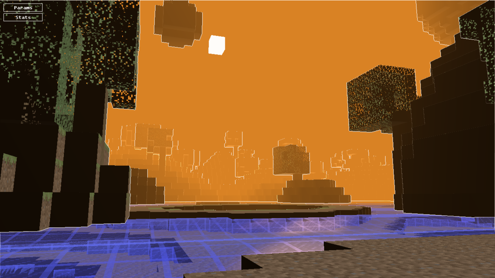

<h2> 👨🏻‍💻 About Me </h2>

 I'm an aspiring game developper that enjoys making creative games and learning new ways to make them

- 🎓 &nbsp; I'm currently a master's degree student at CNAM-ENJMIN in programming.
- 💻 &nbsp; Right now I'm very passionate about procedural generation and AI
- 🌱 &nbsp; I often go for a walk outside and take pictures of nature and animals.
- ✏️ &nbsp; I like to draw illustrations and create characters. I've been learning how to draw since I was 13
- 🔧 &nbsp; I've made games in multiple engines but my main ones are mostly Unity and Godot.

<h2>🛠 Tech Stack</h2>

- 💻 &nbsp; Python | Java | C++ | C# | C | Lua
- 🔧 &nbsp; Visual Studio | Visual Studio code  | Git
- 🖥 &nbsp; ClipStudioPaint | Photoshop | MedibangPaint | Blender

<h2> 💻 Recent Projects </h2>

  

Minecraft recreation in C++ and OpenGL (Cnam-ENJMIN)

  
  Ant AI in C++ based on the Google AI 2011 Challenge (Cnam-ENJMIN)

  
  Co-op bullet hell game develloped in Unity (Cnam-ENJMIN)
  Link here : https://shanori.itch.io/triose

<h2> 💻 Older Projects </h2>

<h2> 🤝🏻 Connect with Me </h2>

&nbsp;   
&nbsp;   
&nbsp; 

<h3 align="center">
  Itch.io : 
</h3>
