<h2> 👨🏻‍💻 About Me </h2>

 I'm an aspiring game developper that enjoys making creative games and learning new ways to make them

- 🎓 &nbsp; I'm currently a master's degree student at CNAM-ENJMIN in programming.
- 💻 &nbsp; Right now I'm very passionate about procedural generation and AI
- 🌱 &nbsp; I often go for a walk outside and take pictures of nature and animals.
- ✏️ &nbsp; I like to draw illustrations and create characters. I've been learning how to draw since I was 13
- 🔧 &nbsp; I've made games in multiple engines but my main ones are mostly Unity and Godot.

<h2>🛠 Tech Stack</h2>

- 💻 &nbsp; C++ | C# | Python | Java | C | Lua
- 🔧 &nbsp; Visual Studio | Visual Studio code  | Git
- 🖥 &nbsp; ClipStudioPaint | Photoshop | MedibangPaint | Blender

<h2> 🎮 Itch.io Page https://lyrdinn.itch.io/  </h2>

<h2> 💻 Recent Projects </h2>

  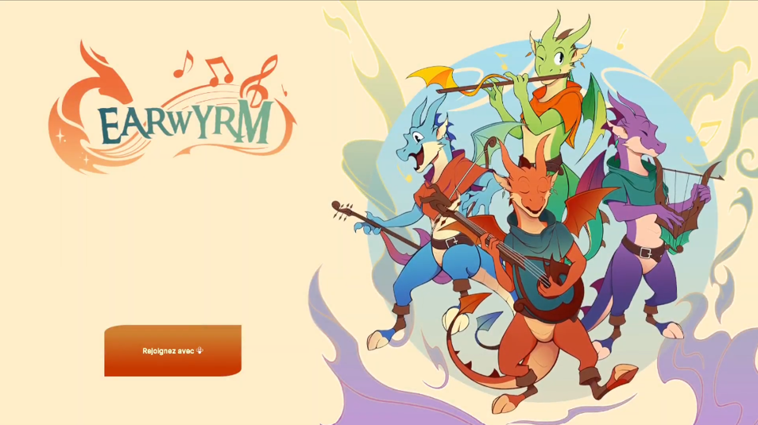
  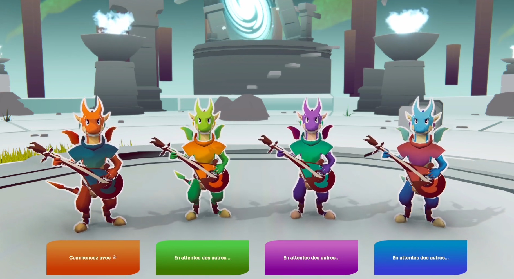
  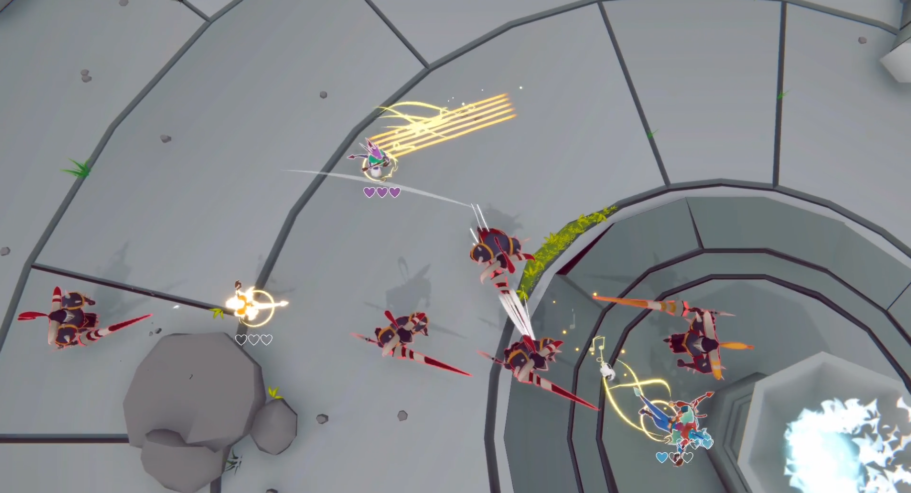

  Earwyrm a co-op rythm-action game, my M1 project  (Cnam-ENJMIN)  
  Trailer here : https://www.youtube.com/watch?v=xS_NTMbvMz4  
  Link here : https://earwyrm.itch.io/earwyrm

  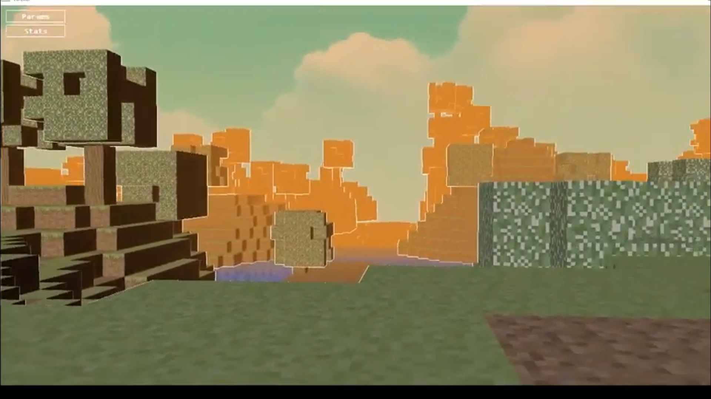
  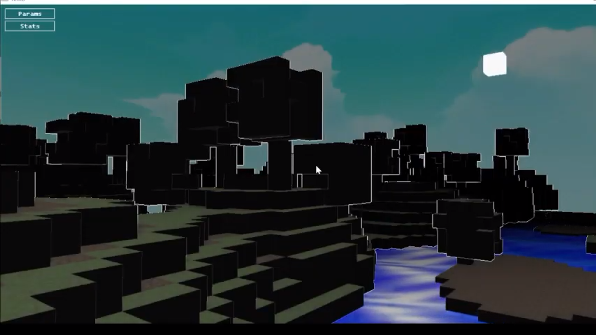

  Minecraft recreation in C++ and OpenGL (Cnam-ENJMIN)  
  Gameplay here : https://www.youtube.com/watch?v=0yXIqEj37sA

  

  Ant AI in C++ based on the Google AI 2011 Challenge (Cnam-ENJMIN)

  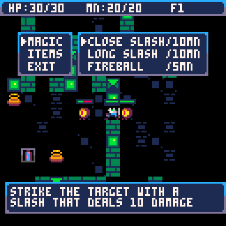
  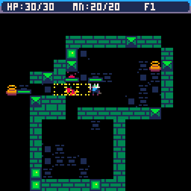

  Pico8 procedural dungeon game (Personnal project)  
  Link here : https://github.com/Lyrdinn/Dungeon_game_pico8

  

  Co-op bullet hell game develloped in Unity (Cnam-ENJMIN)  
  Link here : https://shanori.itch.io/triose

  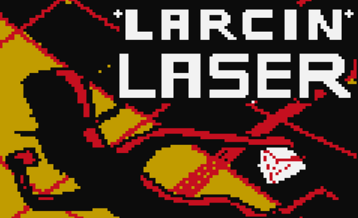

  Larcin lazer demake developped in C++ (Cnam-ENJMIN) (game belongs to @DocGeraud)  
  \nLink here : https://github.com/Lyrdinn/LarcinLazer

<h2> 💻 Older Projects </h2>

  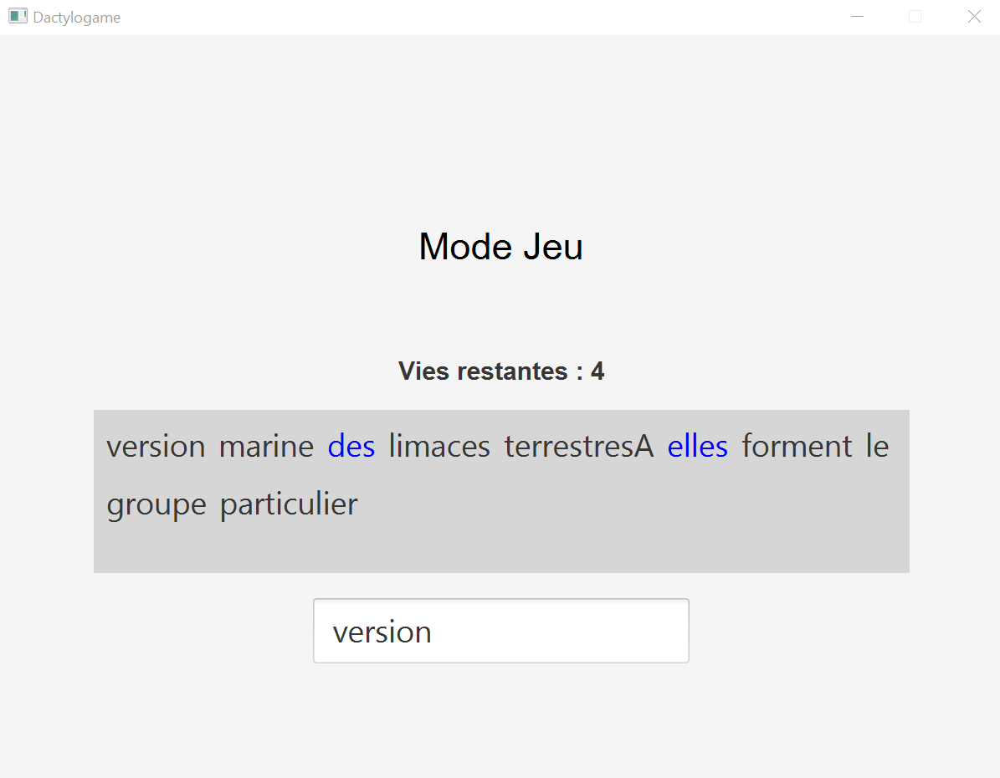
  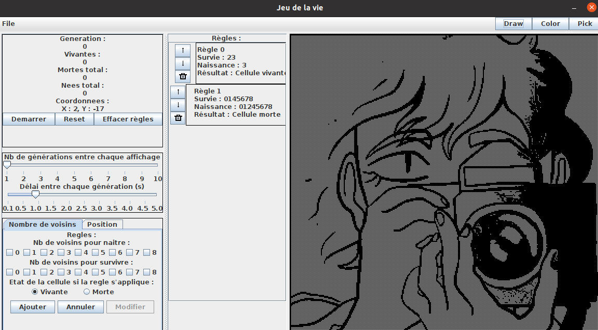
  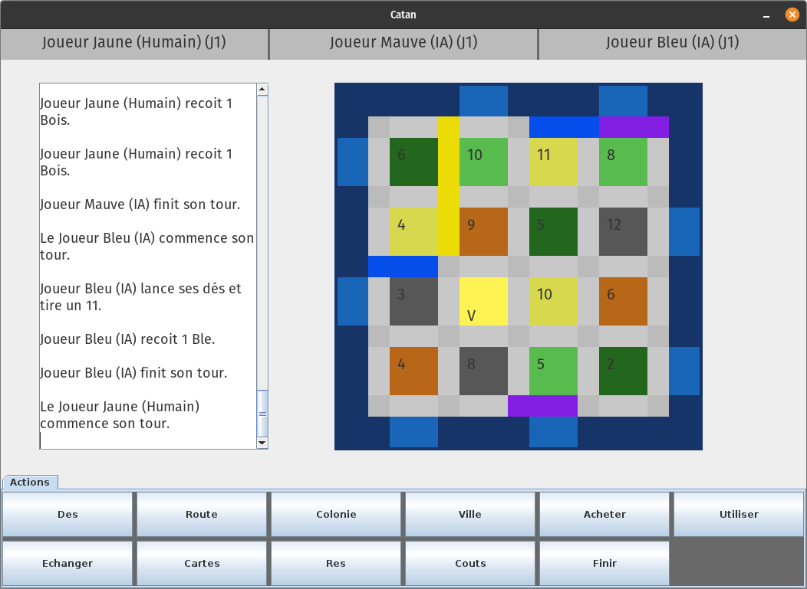

  Various games develloped in Java (Licence Informatique Paris-Cité)

  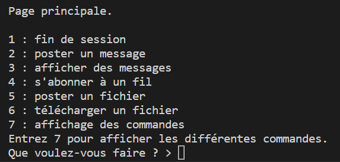
  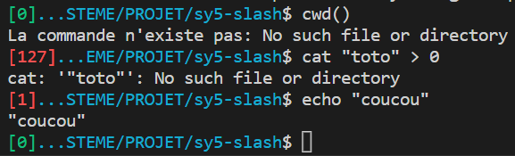

  One of the C project I did. Client/Server social network using TCP and UDP (Licence Informatique Paris-Cité)

  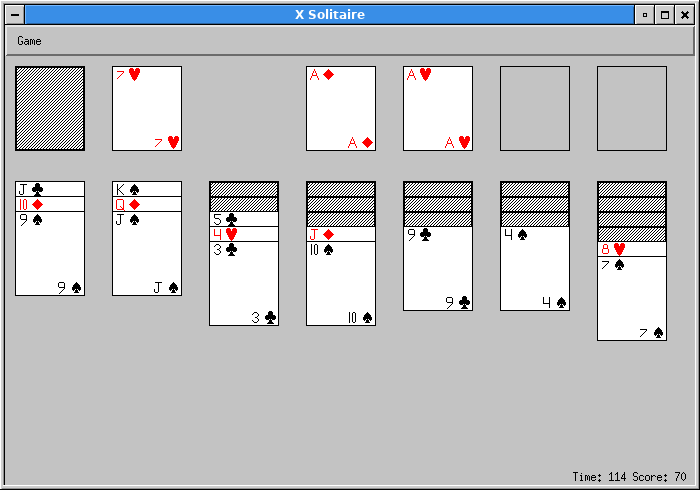

  Solitaire game solver algorithm in Ocaml (Licence Informatique Paris-Cité)

<h2> 🤝🏻 Connect with Me </h2>

&nbsp;   
&nbsp;   
&nbsp; 

