<h2> 👨🏻‍💻 About Me </h2>

 I'm an aspiring gameplay programmer that enjoys learning and making creative games. I studied for 3 years in Computer Science at the Université Paris-Cité and I'm currently in my 2nd year game programming master's degree at CNAM-ENJMIN. 

- 🔧 &nbsp; I've made games in multiple engines, my favorite ones are mostly Unreal, Unity and Godot.
- 🎮 &nbsp; I play a lot of varied genres of games such as : Platformers, rogue-likes, action games and rpgs both Indie and AAA
- 💻 &nbsp; I'm very passionate about procedural generation and AI.
- ✏️ &nbsp; I like to draw illustrations and create characters. I've been learning how to draw since I was 13
- 🌱 &nbsp; I often go for a walk outside and take pictures of nature and animals.

<h2>🛠 Tech Stack</h2>

- 💻 &nbsp; C++ | C# | Blueprint | Python | Java | C | Lua
- 🎮 &nbsp; Unreal | Unity | Godot | Pico8 | Renpy
- 🔧 &nbsp; Visual Studio | Visual Studio code  | Git | Perforce
- 🖥 &nbsp; Waterfall | Scrum | Agile | Sprint | Notion | Confluence | Jira
- 🖥 &nbsp; ClipStudioPaint | Adobe suite | MedibangPaint | Blender

<h2> 🎮 Itch.io Page https://lyrdinn.itch.io/  </h2>

<h2> 💻 Recent Projects </h2>

<h2 align = "center" href="https://lyrdinn.itch.io/farm-bunnies" target="_blank">
  Farm Bunnies
</h2>

  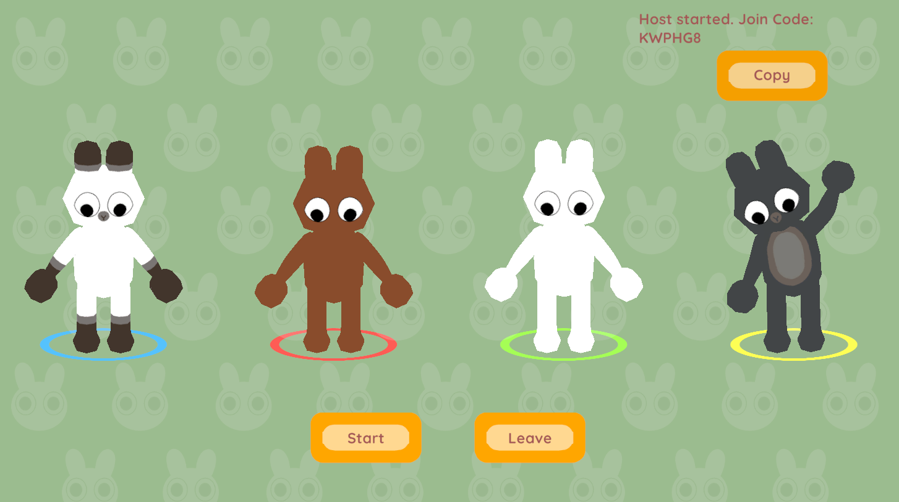
  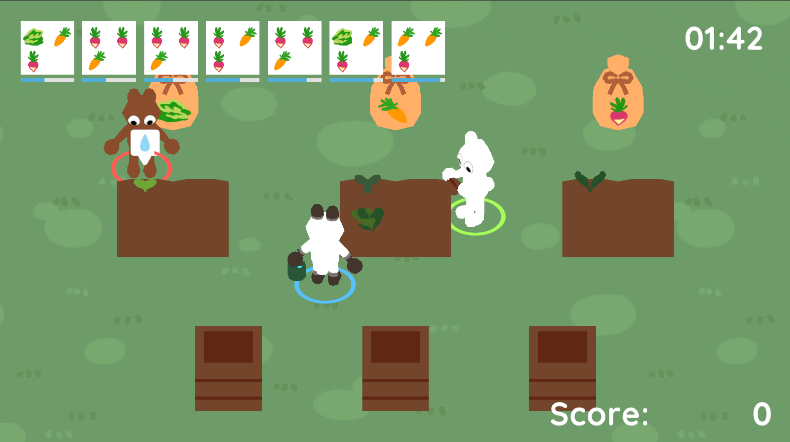

  An online co-op farming game for 1 to 4 players (Game Jam)  

&nbsp; <a href="https://lyrdinn.itch.io/farm-bunnies" target="_blank" rel="noopener noreferrer"> <a>

<h2 align = "center" href="https://youtu.be/8OLGj11ykbM" target="_blank">
  Shattered Hourglass
</h2>

  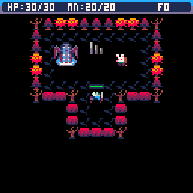
  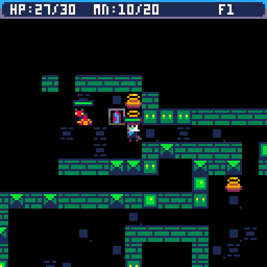

  Pico8 procedural dungeon game (Personal project)  
  Link here : https://github.com/Lyrdinn/Dungeon_game_pico8

&nbsp; <a href="https://lyrdinn.itch.io/shattered-hourglass" target="_blank" rel="noopener noreferrer"> <a>
&nbsp; <a href="https://youtu.be/8OLGj11ykbM" target="_blank" rel="noopener noreferrer"> <a>

<h2 align = "center" href="https://www.youtube.com/watch?v=hAdCEOZhUKs" target="_blank">
  They Make Sounds
</h2>

  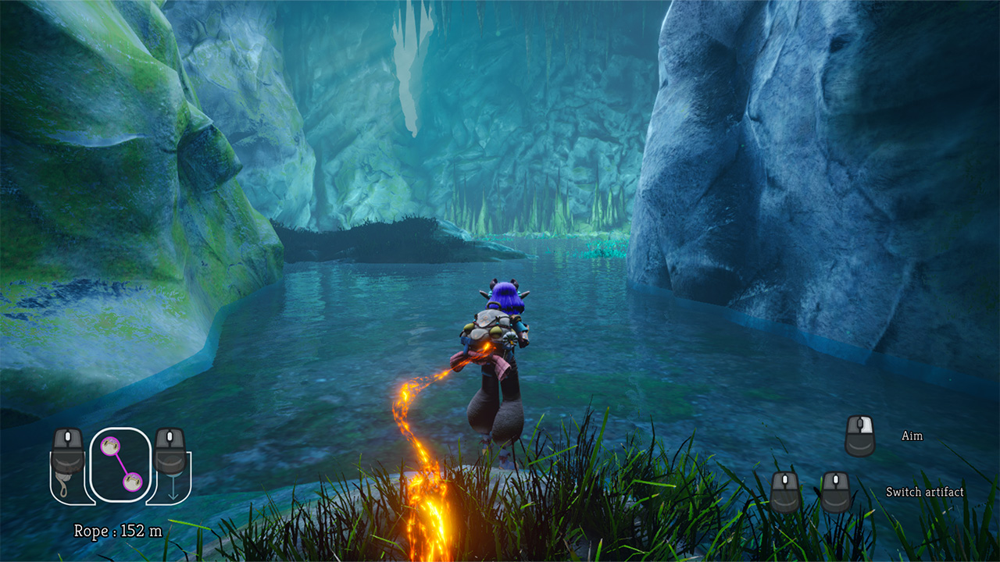
  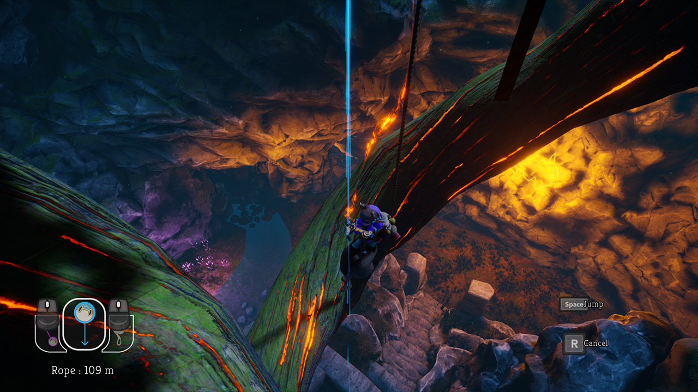
  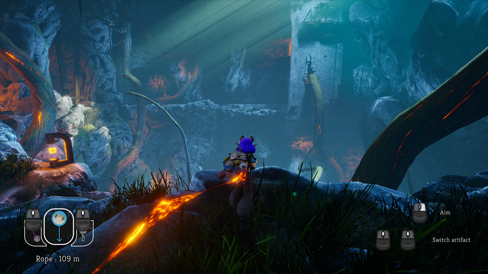

  They Make Sound, an exploration/speleology game, my M2 vertical slice project made in a team of 10 (2 programmers) (Cnam-ENJMIN)  
  Trailer here : https://youtu.be/-RXQFmPGzjY  
  Link here : https://theymakesounds.itch.io/they-make-sounds   
  Code extracts here : https://github.com/Lyrdinn/TheyMakeSounds  

&nbsp; <a href="https://theymakesounds.itch.io/they-make-sounds" target="_blank" rel="noopener noreferrer"> <a>
&nbsp; <a href="https://youtu.be/-RXQFmPGzjY" target="_blank" rel="noopener noreferrer"> <a>

<h2 align = "center">
  Card Game
</h2>

  
  
  

  Arcanistes en herbe, a card game prototype/proof of concept I made for my 2-months summer internship in a team of 3 (MNHN-CESCO lab)  
  Linkedin post here : https://www.linkedin.com/posts/marina-secord-4b01202a9_en-activity-7246912956901244928-V8rn?utm_source=share&utm_medium=member_desktop  

<h2 align = "center">
  Earwyrm
</h2>

  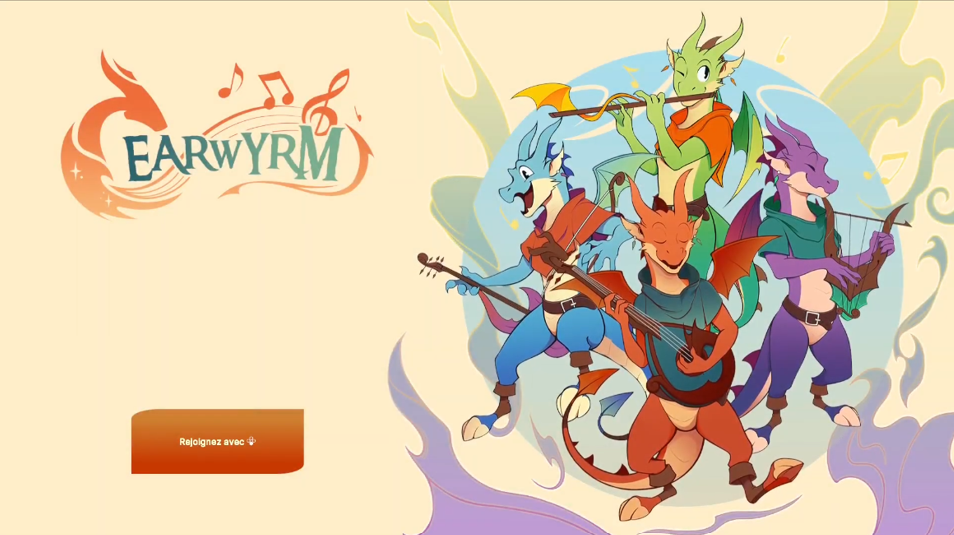
  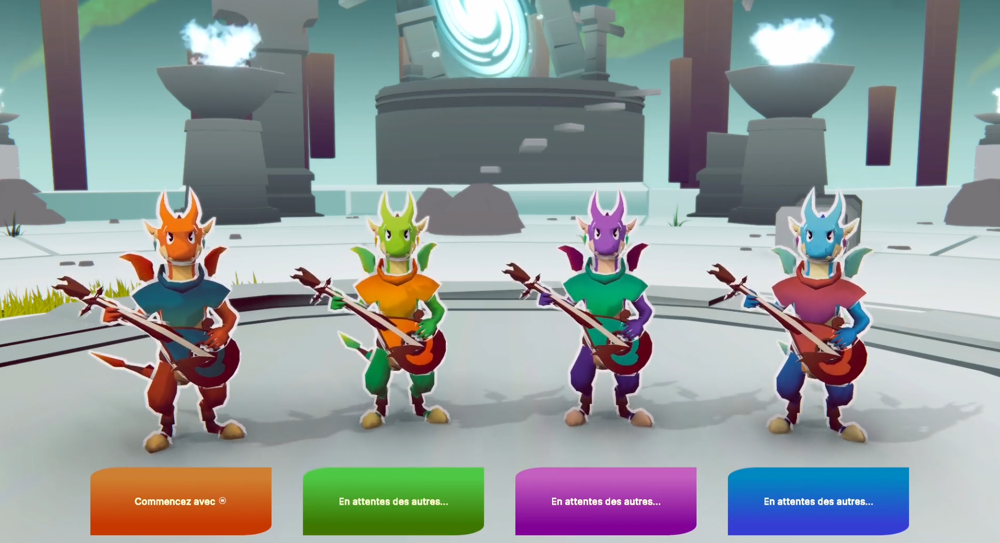
  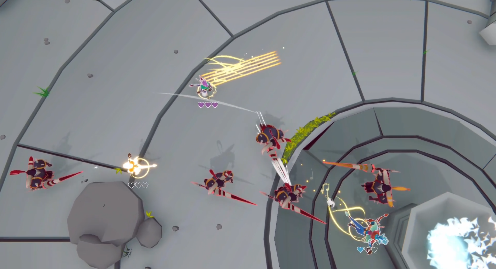

  Earwyrm a co-op rhythm-action game, my M1 project in a team of 6 (Cnam-ENJMIN)  
  Trailer here : https://www.youtube.com/watch?v=xS_NTMbvMz4  
  Link here : https://earwyrm.itch.io/earwyrm  
  Code extracts here : https://github.com/Lyrdinn/EarwyrmPublicRepository

&nbsp; <a href="https://earwyrm.itch.io/earwyrm" target="_blank" rel="noopener noreferrer"> <a>
&nbsp; <a href="https://youtu.be/xS_NTMbvMz4" target="_blank" rel="noopener noreferrer"> <a>

<h2 align = "center">
  Quoridor
</h2>

  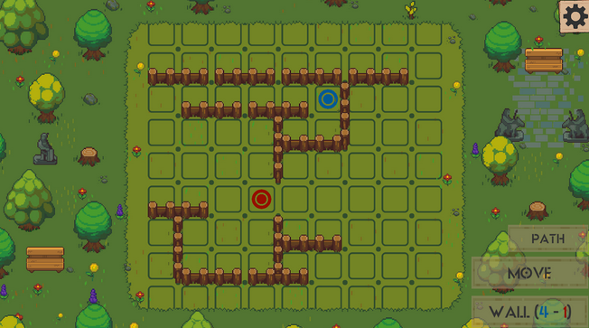
  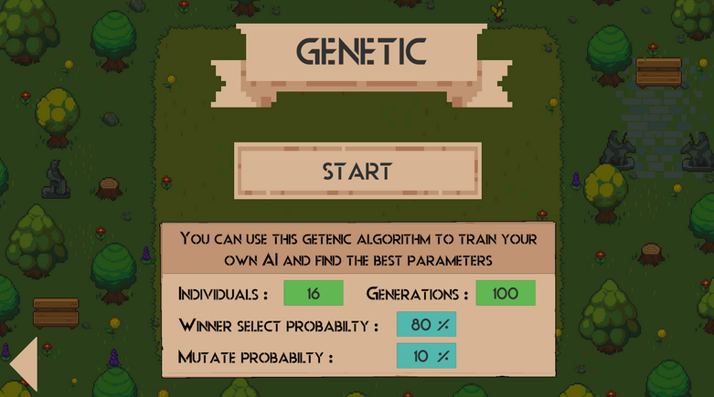

  Implementation of the Genetics Algorithm to Quoridor. Ai compete against each other, with the best one emerging at the end. (Cnam-ENJMIN)  
  Link here : https://github.com/Sand-Fox/Quoridor-Genetic-Algorithm

<h2 align = "center">
  OpenGL Minecraft
</h2>

  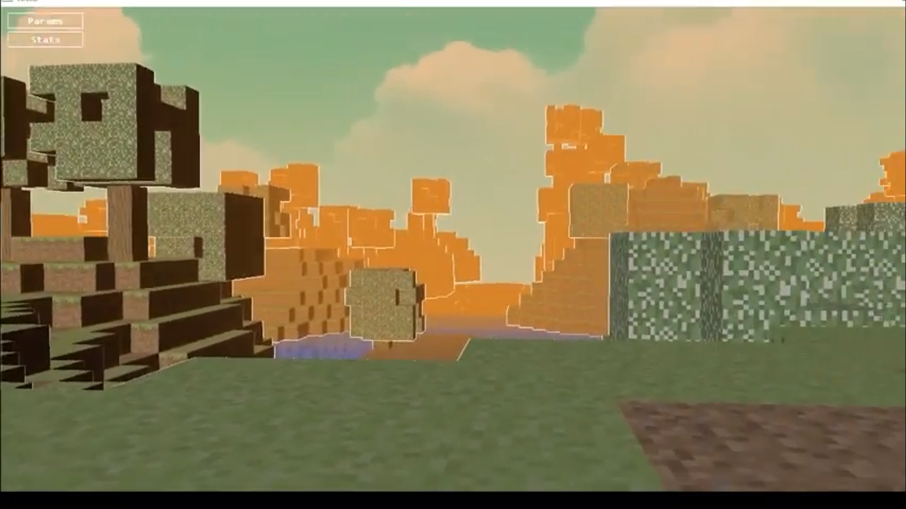
  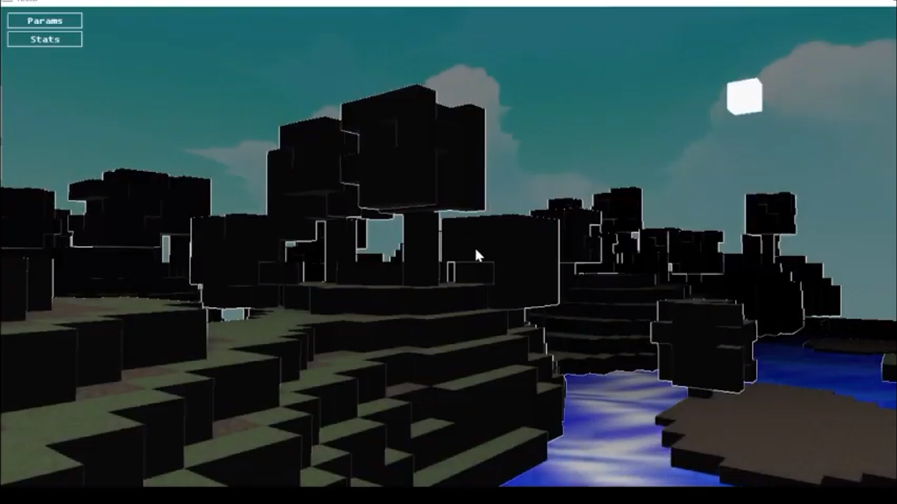

  Minecraft recreation in C++ and OpenGL (Cnam-ENJMIN)  
  Gameplay here : https://www.youtube.com/watch?v=0yXIqEj37sA  
  Link here : https://github.com/Lyrdinn/Projet-Minicraft

<h2> 💻 Older Projects </h2>

  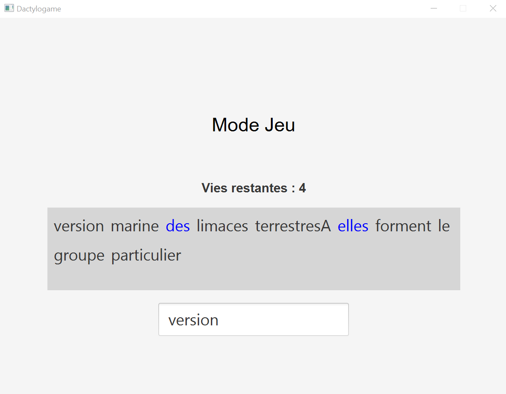
  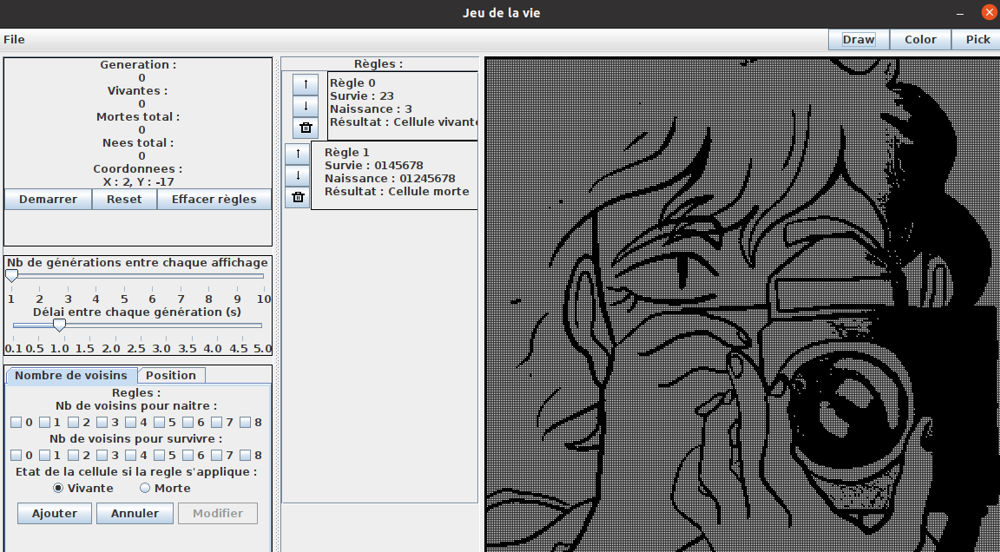
  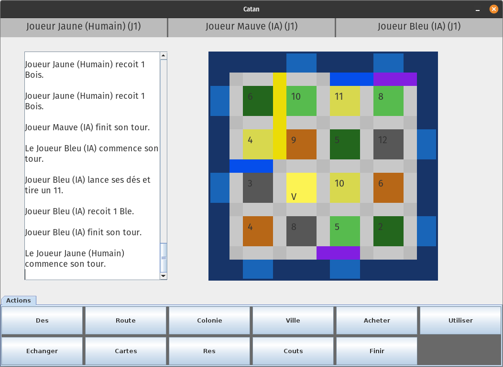

  Various games developped in Java (Licence Informatique Paris-Cité)

  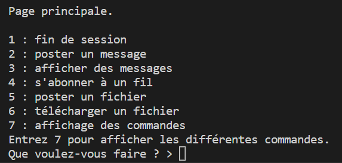
  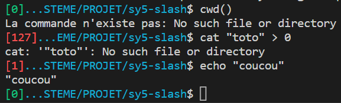

  One of the C project I did. Client/Server social network using TCP and UDP in teams of 2 to 3 (Licence Informatique Paris-Cité)

  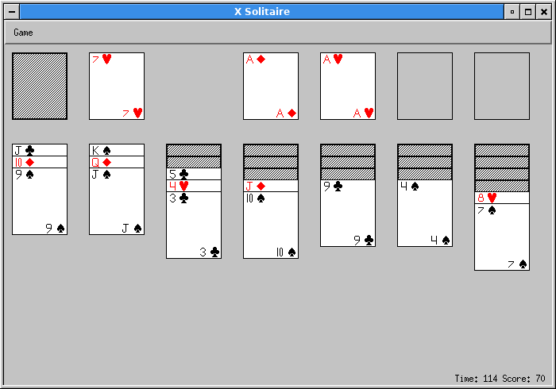

  Solitaire game solver algorithm in Ocaml in a team of 2 (Licence Informatique Paris-Cité)

<h2> 🤝🏻 Connect with Me </h2>

&nbsp;   
&nbsp;   
&nbsp; 

