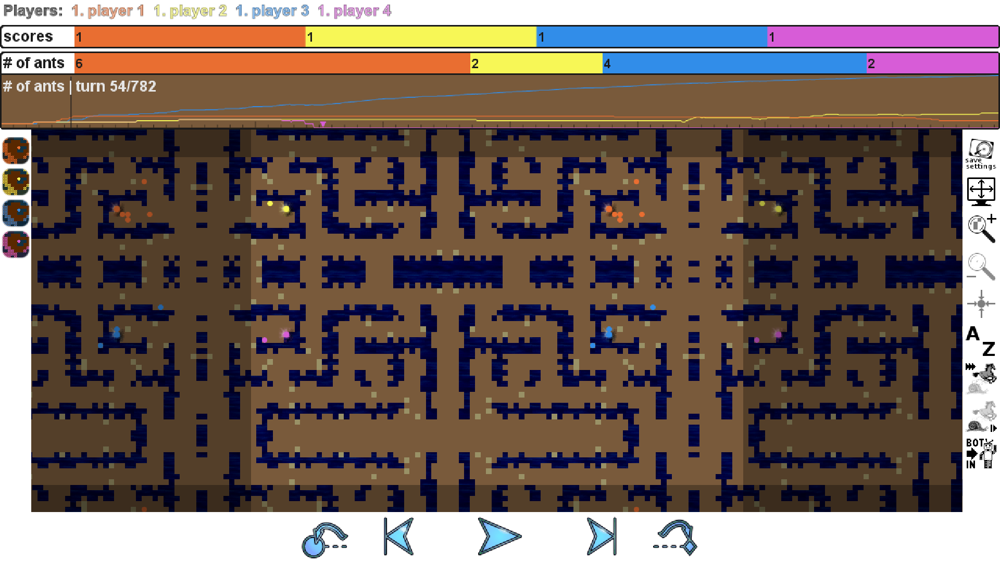
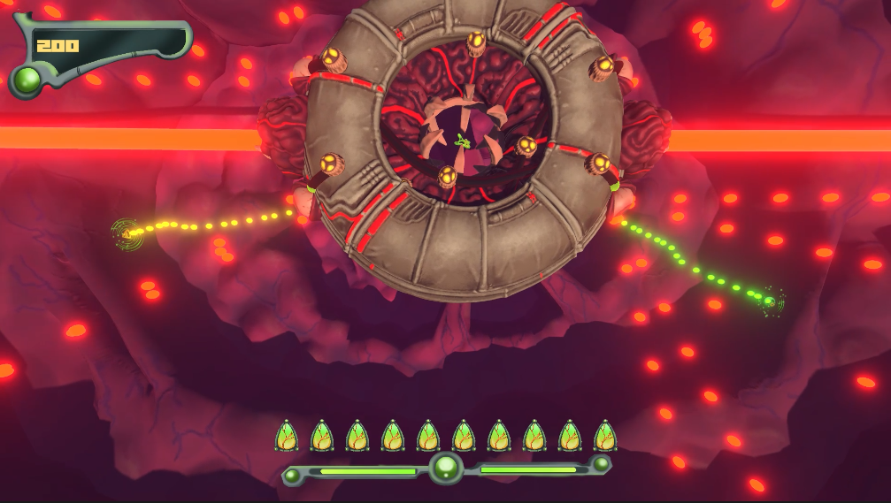

<h2> 👨🏻‍💻 About Me </h2>

 I'm an aspiring gameplay programmer that enjoys learning and making creative games. I studied for 3 years in Computer Science at the Université Paris-Cité and I'm currently in my 2nd year game programming master's degree at CNAM-ENJMIN. 

- 🎓 &nbsp; I'm currently a master's degree game programming student at CNAM-ENJMIN and I'm trying to specialize in gameplay programming.
- 🔧 &nbsp; I've made games in multiple engines but my favorite ones are mostly Unity, Godot and Unreal.
- 💻 &nbsp; I'm very passionate about procedural generation and AI.
- ✏️ &nbsp; I like to draw illustrations and create characters. I've been learning how to draw since I was 13
- 🌱 &nbsp; I often go for a walk outside and take pictures of nature and animals.

<h2>🛠 Tech Stack</h2>

- 💻 &nbsp; C++ | C# | Python | Java | C | Lua
- 🎮 &nbsp; Unity | Godot | Unreal | Pico8 | Renpy
- 🔧 &nbsp; Visual Studio | Visual Studio code  | Git | Perforce
- 🖥 &nbsp; Waterfall | Scrum | Agile | Sprint
- 🖥 &nbsp; ClipStudioPaint | Photoshop | MedibangPaint | Blender

<h2> 🎮 Itch.io Page https://lyrdinn.itch.io/  </h2>

<h2> 📜 French CV : https://drive.google.com/file/d/1E-XSSfFFk27MB0h5nfY__s9gVb-T0cT8/view?usp=drive_link </h2>

<h2> 📜 English CV : https://drive.google.com/file/d/1S-rU7VCjHWAGsy9bKACV2YUDmqW3VrdN/view?usp=drive_link </h2>

<h2> 💻 Recent Projects </h2>

  

  They Make Sound, an exploration/speology game, my M2 vertical slice project made in a team of 10 (2 programmers) (MNHN-CESCO lab)  
  Ask me for the repository

  
  
  

  Arcanistes en herbe, a card game prototype/proof of concept I made for my 2 months summer internship in a team of 3 (MNHN-CESCO lab)  
  Linkedin post here : https://www.linkedin.com/posts/marina-secord-4b01202a9_en-activity-7246912956901244928-V8rn?utm_source=share&utm_medium=member_desktop  
  Ask me for the repository

  
  
  

  Earwyrm a co-op rythm-action game, my M1 project in a team of 6 (Cnam-ENJMIN)  
  Trailer here : https://www.youtube.com/watch?v=xS_NTMbvMz4  
  Link here : https://earwyrm.itch.io/earwyrm  
  Ask me for the repository

  
  

  Implementation of the Genetics Algorithm to Quoridor. Ai compete against each other, with the best one emerging at the end. (Cnam-ENJMIN)  
  Link here : https://github.com/Sand-Fox/Quoridor-Genetic-Algorithm

  
  

  Minecraft recreation in C++ and OpenGL (Cnam-ENJMIN)  
  Gameplay here : https://www.youtube.com/watch?v=0yXIqEj37sA  
  Link here : https://github.com/Lyrdinn/Projet-Minicraft

  

  Ant AI in C++ based on the Google AI 2011 Challenge in a team of 3 (Cnam-ENJMIN)  
  Link here : https://github.com/Lyrdinn/FourmisTP

  
  

  Pico8 procedural dungeon game (Personnal project)  
  Link here : https://github.com/Lyrdinn/Dungeon_game_pico8

  
  

  Co-op bullet hell game develloped in Unity in a team of 10 (Cnam-ENJMIN)  
  Link here : https://shanori.itch.io/triose

  
  

  Larcin lazer demake developped in C++ in a team of 2 (Cnam-ENJMIN) (game belongs to @DocGeraud)  
  Link here : https://github.com/Lyrdinn/LarcinLazer

<h2> 💻 Older Projects </h2>

  
  
  

  Various games develloped in Java (Licence Informatique Paris-Cité)

  
  

  One of the C project I did. Client/Server social network using TCP and UDP in teams of 2 to 3 (Licence Informatique Paris-Cité)

  

  Solitaire game solver algorithm in Ocaml in a team of 2 (Licence Informatique Paris-Cité)

<h2> 🤝🏻 Connect with Me </h2>

&nbsp;   
&nbsp;   
&nbsp; 

